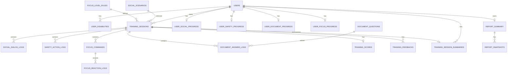

# ?곗씠?곕쿋?댁뒪 援ъ“ ?ㅺ퀎

WBS ??ぉ: 3.4 DB/ERD ?ㅺ퀎 (https://www.notion.so/3-4-DB-ERD-4faffa9d0afd49bf8053d11ae9062d8b?pvs=21)
?곹깭: ?€湲?
?좏삎: ?ㅺ퀎

# ?곗씠?곕쿋?댁뒪 援ъ“ ?ㅺ퀎

## 1. ?ㅺ퀎 湲곗?

```
user_db     : ?ъ슜??怨꾩젙, ?뚯썝媛€?? 濡쒓렇?? ?댁젙蹂?愿€由щ? ?대떦?쒕떎.
training_db : ?ы쉶???덉쟾/吏묒쨷??臾몄꽌?댄빐 ?덈젴???몄뀡, 濡쒓렇, ?먯닔, ?쇰뱶諛깆쓣 ?대떦?쒕떎.
```

## 1.1 user_id ?ㅺ퀎 ?먯튃

```
- ?ъ슜?먮퀎 ?곗씠?곕뒗 諛섎뱶??user_id瑜?湲곗??쇰줈 ?뚯쑀?먮? ?앸퀎?쒕떎.
- ?대씪?댁뼵???붿껌 諛붾뵒?먯꽌 user_id瑜?吏곸젒 諛쏆? ?딄퀬, ?몄쬆 ?좏겙?먯꽌 異붿텧???ъ슜??ID瑜??쒕쾭媛€ ?ъ슜?쒕떎.
- ?덈젴 ?먮낯 肄섑뀗痢??뚯씠釉붿뿉??user_id瑜??ｌ? ?딅뒗??
  ?? social_scenarios, safety_scenarios, safety_scenes, safety_choices, document_questions
- ?ъ슜???섑뻾 寃곌낵 ?먮뒗 ?ъ슜?먮퀎 ?붿빟 ?뚯씠釉붿뿉??user_id瑜?吏곸젒 ?€?ν븳??
  ?? training_sessions, user_*_progress, training_session_summaries, report_summary
- ?몃? 濡쒓렇 ?뚯씠釉붿? session_id瑜??듯빐 user_id瑜?異붿쟻?쒕떎.
  ?? social_dialog_logs, safety_action_logs, focus_reaction_logs, document_answer_logs
```

## 1.2 ?뺥빀??蹂댁셿 湲곗?

```
- ?덈젴 湲곕줉 紐⑸줉 ?붾㈃?€ ?먮낯 濡쒓렇 ?뚯씠釉붿쓣 吏곸젒 議고쉶?섏? ?딄퀬 training_session_summaries瑜??곗꽑 議고쉶?쒕떎.
- ?덈젴 ?곸꽭 ?붾㈃?€ session_id 湲곕컲?쇰줈 ?먮낯 濡쒓렇 ?뚯씠釉붿쓣 議고쉶?쒕떎.
- training_session_summaries??紐⑸줉 ?붾㈃???꾩슂???쒕굹由ъ삤紐? 移댄뀒怨좊━, ?먯닔, ?뺣떟 ?? ?쇰뱶諛??붿빟???ㅻ깄???뺥깭濡?蹂닿??쒕떎.
- 吏묒쨷???덈젴?€ 蹂꾨룄 ?곸꽭蹂닿린 API瑜??쒓났?섏? ?딄퀬, progress 議고쉶?€ sessions 紐⑸줉 議고쉶濡?寃곌낵 ?뺤씤???€泥댄븳??
- focus_reaction_logs???대? 遺꾩꽍, 由ы룷??怨꾩궛, ?댁쁺 ?먭? ?⑸룄濡??ъ슜?쒕떎.
```

## 1.3 training_session_summaries ?꾩닔 ?ㅺ퀎 湲곗?

?덈젴 湲곕줉 紐⑸줉 API?€ ?덈젴 ?꾪솴 ?붾㈃??議고쉶 ?깅뒫 諛?臾몄꽌 媛??뺥빀?깆쓣 ?꾪빐 `training_session_summaries`???ㅼ쓬 ?꾨뱶瑜??ы븿?쒕떎.

### ?꾩닔 ?띿꽦

| ?띿꽦紐?| ?ㅻ챸 |
| --- | --- |
| summary_id | ?덈젴 ?몄뀡 ?붿빟 怨좎쑀 ID |
| user_id | ?ъ슜??ID |
| session_id | ?덈젴 ?몄뀡 ID |
| training_type | ?덈젴 ?좏삎: SOCIAL, SAFETY, FOCUS, DOCUMENT |
| sub_type | ?몃? ?좏삎. ?ы쉶?깆? jobType, 吏묒쨷?μ? level 媛??€??|
| scenario_id | ?쒕굹由ъ삤 ID. ?쒕굹由ъ삤 湲곕컲 ?덈젴???꾨땶 寃쎌슦 NULL ?덉슜 |
| scenario_title | 紐⑸줉 ?붾㈃ ?쒖떆???쒕굹由ъ삤 ?쒕ぉ ?ㅻ깄??|
| category | ?덉쟾 ?덈젴 移댄뀒怨좊━ ??紐⑸줉 ?꾪꽣??遺꾨쪟媛?|
| score | ?€???먯닔 |
| accuracy_rate | ?뺥솗?? 吏묒쨷???먮뒗 ?뺣떟瑜?湲곕컲 ?덈젴?먯꽌 ?ъ슜 |
| correct_count | ?뺣떟 ??|
| total_count | ?꾩껜 臾명빆/?좏깮/吏€????|
| wrong_count | ?ㅻ떟 ??|
| average_reaction_ms | ?됯퇏 諛섏쓳 ?쒓컙. 吏묒쨷???덈젴?먯꽌 ?ъ슜 |
| feedback_summary | 紐⑸줉 ?붾㈃ ?쒖떆??媛꾨왂 ?쇰뱶諛?|
| completed_at | ?덈젴 ?꾨즺 ?쇱떆 |
| created_at | ?붿빟 ?앹꽦 ?쇱떆 |

### ?쒖빟 議곌굔

```
PK: summary_id
FK: user_id ??users.user_id
FK: session_id ??training_sessions.session_id
UNIQUE: session_id
NOT NULL: user_id, session_id, training_type, completed_at, created_at
CHECK: training_type IN ('SOCIAL', 'SAFETY', 'FOCUS', 'DOCUMENT')
CHECK: score BETWEEN 0 AND 100 ?먮뒗 NULL ?덉슜
CHECK: accuracy_rate BETWEEN 0 AND 100 ?먮뒗 NULL ?덉슜
CHECK: correct_count >= 0 ?먮뒗 NULL ?덉슜
CHECK: total_count >= 0 ?먮뒗 NULL ?덉슜
CHECK: wrong_count >= 0 ?먮뒗 NULL ?덉슜
CHECK: average_reaction_ms >= 0 ?먮뒗 NULL ?덉슜
```

### 議고쉶 湲곗?

```
- ?덈젴 湲곕줉 紐⑸줉 API??training_session_summaries瑜??곗꽑 議고쉶?쒕떎.
- ?곸꽭 議고쉶 API??training_session_summaries媛€ ?꾨땲??媛??덈젴蹂??먮낯 濡쒓렇 ?뚯씠釉붿쓣 議고쉶?쒕떎.
- ?덈젴 ?꾨즺 ??Training Service媛€ ?먮낯 濡쒓렇, ?먯닔, ?쇰뱶諛??€????training_session_summaries瑜??앹꽦?쒕떎.
```

## 2. ?듭떖 ERD



---

# 3. user_db

## 3.1 users

?ъ슜??怨꾩젙怨?湲곕낯 ?뺣낫瑜?愿€由ы븯湲??꾪븳 ?뚯씠釉?

### ?띿꽦

| ?띿꽦紐?| ?ㅻ챸 |
| --- | --- |
| user_id | ?ъ슜??怨좎쑀 ID |
| login_id | 濡쒓렇?몄뿉 ?ъ슜?섎뒗 ?꾩씠??|
| password_hash | 鍮꾨?踰덊샇 ?댁떆媛?|
| name | ?ъ슜???대쫫 |
| birth_date | ?앸뀈?붿씪 |
| gender | ?깅퀎 |
| email | ?대찓??|
| desired_job | ?щ쭩吏곷Т |
| status | ?ъ슜??怨꾩젙 ?곹깭 |
| created_at | ?앹꽦?쇱떆 |
| updated_at | ?섏젙?쇱떆 |
| last_login_at | 留덉?留?濡쒓렇???쇱떆 |

### ?쒖빟 議곌굔

```
PK: user_id
UNIQUE: login_id, email
NOT NULL: login_id, password_hash, name, birth_date, email, status, created_at
CHECK: status IN ('ACTIVE', 'LOCKED', 'WITHDRAWN')
CHECK: gender IN ('MALE', 'FEMALE', 'NONE') ?먮뒗 NULL ?덉슜
```

## 3.2 user_disabilities

?ъ슜?먯쓽 ?μ븷?좏삎 以묐났 ?좏깮 ?뺣낫瑜??€?ν븯湲??꾪븳 ?뚯씠釉?

### ?띿꽦

| ?띿꽦紐?| ?ㅻ챸 |
| --- | --- |
| disability_id | ?μ븷?좏삎 ?좏깮 怨좎쑀 ID |
| user_id | ?ъ슜??ID |
| disability_type | ?μ븷?좏삎 |
| created_at | ?앹꽦?쇱떆 |

### ?쒖빟 議곌굔

```
PK: disability_id
FK: user_id ??users.user_id
NOT NULL: user_id, disability_type, created_at
UNIQUE: user_id + disability_type
```

---

# 4. training_db

## 4.1 training_sessions

?덈젴 ?쒖옉遺€??醫낅즺源뚯???怨듯넻 ?몄뀡??愿€由ы븯湲??꾪븳 ?뚯씠釉?

### ?띿꽦

| ?띿꽦紐?| ?ㅻ챸 |
| --- | --- |
| session_id | ?덈젴 ?몄뀡 怨좎쑀 ID |
| user_id | ?ъ슜??ID |
| training_type | ?덈젴 ?좏삎 |
| sub_type | ?몃? ?좏삎 |
| scenario_id | ?좏깮???쒕굹由ъ삤 ID |
| status | ?덈젴 吏꾪뻾 ?곹깭 |
| current_step | ?꾩옱 吏꾪뻾 ?④퀎 |
| started_at | ?쒖옉?쇱떆 |
| ended_at | 醫낅즺?쇱떆 |

### ?쒖빟 議곌굔

```
PK: session_id
FK: user_id ??users.user_id
NOT NULL: user_id, training_type, status, started_at
CHECK: training_type IN ('SOCIAL', 'SAFETY', 'FOCUS', 'DOCUMENT')
CHECK: status IN ('IN_PROGRESS', 'COMPLETED', 'FAILED')
CHECK: training_type != 'FOCUS' OR sub_type IS NOT NULL
- 吏묒쨷???덈젴??sub_type?먮뒗 ?좏깮??level 媛믪쓣 ?€?ν븳??
```

## 4.2 social_scenarios

?ы쉶???덈젴???곹솴(?쒕굹由ъ삤) 肄섑뀗痢좊? 愿€由ы븯湲??꾪븳 ?뚯씠釉?

### ?띿꽦

| ?띿꽦紐?| ?ㅻ챸 |
| --- | --- |
| scenario_id | ?쒕굹由ъ삤 怨좎쑀 ID |
| job_type | 吏곷Т ?좏삎 |
| title | ?쒕굹由ъ삤 ?쒕ぉ |
| background_text | 諛곌꼍 ?ㅻ챸 |
| situation_text | ?곹솴 ?ㅻ챸 |
| character_info | ?깆옣 ?몃Ъ ?뺣낫 |
| difficulty | ?쒖씠??|
| is_active | ?ъ슜 ?щ? |

### ?쒖빟 議곌굔

```
PK: scenario_id
NOT NULL: job_type, title, situation_text
CHECK: job_type IN ('OFFICE','LABOR')
DEFAULT: is_active = true
```

## 4.3 social_dialog_logs

?ы쉶???덈젴???ъ슜??AI ?€??濡쒓렇瑜??€?ν븯湲??꾪븳 ?뚯씠釉?

### ?띿꽦

| ?띿꽦紐?| ?ㅻ챸 |
| --- | --- |
| log_id | ?€??濡쒓렇 怨좎쑀 ID |
| session_id | ?덈젴 ?몄뀡 ID |
| turn_no | ?€???쒖꽌 |
| speaker | 諛쒗솕 二쇱껜 |
| content | ?€???댁슜 |
| created_at | ?앹꽦?쇱떆 |

### ?쒖빟 議곌굔

```
PK: log_id
FK: session_id ??training_sessions.session_id
NOT NULL: session_id, turn_no, speaker, content, created_at
CHECK: speaker IN ('USER', 'AI')
UNIQUE: session_id + turn_no + speaker
```

## 4.3.1 user_social_progress

?ъ슜?먮퀎 ?ы쉶???덈젴 理쒖떊 吏꾪뻾 ?붿빟??愿€由ы븯湲??꾪븳 ?뚯씠釉?

### ?띿꽦

| ?띿꽦紐?| ?ㅻ챸 |
| --- | --- |
| progress_id | ?ы쉶??吏꾪뻾 ?곹깭 怨좎쑀 ID |
| user_id | ?ъ슜??ID |
| recent_session_id | 理쒓렐 ?꾨즺???ы쉶???덈젴 ?몄뀡 ID |
| recent_score | 理쒓렐 ?ы쉶???덈젴 ?€???먯닔 |
| recent_feedback_summary | 理쒓렐 ?ы쉶???덈젴 媛꾨왂 ?쇰뱶諛?|
| completed_count | ?꾨즺???ы쉶???덈젴 ?잛닔 |
| last_completed_at | 留덉?留??꾨즺?쇱떆 |
| updated_at | ?섏젙?쇱떆 |

### ?쒖빟 議곌굔

```
PK: progress_id
FK: user_id ??users.user_id
FK: recent_session_id ??training_sessions.session_id
UNIQUE: user_id
NOT NULL: user_id, completed_count, updated_at
CHECK: recent_score BETWEEN 0 AND 100
CHECK: completed_count >= 0
```

## 4.4 safety_scenarios

?덉쟾 ?덈젴 ?쒕굹由ъ삤瑜?愿€由ы븯湲??꾪븳 ?뚯씠釉?

### ?띿꽦

| ?띿꽦紐?| ?ㅻ챸 |
| --- | --- |
| scenario_id | ?쒕굹由ъ삤 怨좎쑀 ID |
| title | ?쒕굹由ъ삤 ?쒕ぉ |
| category | ?덉쟾 ?덈젴 ?곹솴 遺꾨쪟 |
| description | ?쒕굹由ъ삤 ?ㅻ챸 |
| is_active | ?ъ슜 ?щ? |
| created_at | ?앹꽦?쇱떆 |

### ?쒖빟 議곌굔

```
PK: scenario_id
NOT NULL: title, category, is_active, created_at
CHECK: category IN ('SEXUAL_EDUCATION', 'INFECTIOUS_DISEASE', 'COMMUTE_SAFETY')
DEFAULT: is_active = true
```

## 4.5 safety_scenes

?덉쟾 ?덈젴???λ㈃, ?곹솴, 吏덈Ц???€?ν븯湲??꾪븳 ?뚯씠釉?

### ?띿꽦

| ?띿꽦紐?| ?ㅻ챸 |
| --- | --- |
| scene_id | ?λ㈃ 怨좎쑀 ID |
| scenario_id | ?쒕굹由ъ삤 ID |
| scene_order | ?λ㈃ ?쒖꽌 |
| screen_info | ?붾㈃ ?뺣낫 |
| situation_text | ?곹솴 ?ㅻ챸 |
| question_text | 吏덈Ц ?댁슜 |
| is_end_scene | 醫낅즺 ?λ㈃ ?щ? |

### ?쒖빟 議곌굔

```
PK: scene_id
FK: scenario_id ??safety_scenarios.scenario_id
NOT NULL: scenario_id, scene_order, situation_text, question_text, is_end_scene
UNIQUE: scenario_id + scene_order
DEFAULT: is_end_scene = false
```

## 4.6 safety_choices

?덉쟾 ?덈젴 ?λ㈃蹂??좏깮吏€瑜??€?ν븯湲??꾪븳 ?뚯씠釉?

### ?띿꽦

| ?띿꽦紐?| ?ㅻ챸 |
| --- | --- |
| choice_id | ?좏깮吏€ 怨좎쑀 ID |
| scene_id | ?λ㈃ ID |
| choice_text | ?좏깮吏€ ?댁슜 |
| next_scene_id | ?ㅼ쓬 ?λ㈃ ID |
| is_correct | ?щ컮瑜??좏깮 ?щ? |

### ?쒖빟 議곌굔

```
PK: choice_id
FK: scene_id ??safety_scenes.scene_id
FK: next_scene_id ??safety_scenes.scene_id
NOT NULL: scene_id, choice_text, is_correct
```

## 4.7 safety_action_logs

?덉쟾 ?덈젴?먯꽌 ?ъ슜?먯쓽 ?좏깮 ?대젰???€?ν븯湲??꾪븳 ?뚯씠釉?

### ?띿꽦

| ?띿꽦紐?| ?ㅻ챸 |
| --- | --- |
| action_id | ?좏깮 ?대젰 怨좎쑀 ID |
| session_id | ?덈젴 ?몄뀡 ID |
| scene_id | ?λ㈃ ID |
| choice_id | ?좏깮吏€ ID |
| is_correct | ?뺣떟 ?щ? |
| created_at | ?앹꽦?쇱떆 |

### ?쒖빟 議곌굔

```
PK: action_id
FK: session_id ??training_sessions.session_id
FK: scene_id ??safety_scenes.scene_id
FK: choice_id ??safety_choices.choice_id
NOT NULL: session_id, scene_id, choice_id, is_correct, created_at
```

## 4.7.1 user_safety_progress

?ъ슜?먮퀎 ?덉쟾 ?덈젴 理쒖떊 吏꾪뻾 ?붿빟??愿€由ы븯湲??꾪븳 ?뚯씠釉?

### ?띿꽦

| ?띿꽦紐?| ?ㅻ챸 |
| --- | --- |
| progress_id | ?덉쟾 吏꾪뻾 ?곹깭 怨좎쑀 ID |
| user_id | ?ъ슜??ID |
| recent_session_id | 理쒓렐 ?꾨즺???덉쟾 ?덈젴 ?몄뀡 ID |
| correct_count | ?덉쟾 ?덈젴 ?뺣떟 ?좏깮 ??|
| total_count | ?덉쟾 ?덈젴 ?꾩껜 ?좏깮 ??|
| completed_count | ?꾨즺???덉쟾 ?덈젴 ??|
| last_completed_at | 留덉?留??꾨즺?쇱떆 |
| updated_at | ?섏젙?쇱떆 |

### ?쒖빟 議곌굔

```
PK: progress_id
FK: user_id ??users.user_id
FK: recent_session_id ??training_sessions.session_id
UNIQUE: user_id
NOT NULL: user_id, correct_count, total_count, completed_count, updated_at
CHECK: correct_count >= 0
CHECK: total_count >= 0
CHECK: correct_count <= total_count
CHECK: completed_count >= 0
```

## 4.8 focus_level_rules

吏묒쨷???덈젴???④퀎蹂?洹쒖튃??愿€由ы븯湲??꾪븳 ?뚯씠釉?

### ?띿꽦

| ?띿꽦紐?| ?ㅻ챸 |
| --- | --- |
| level | 吏묒쨷???덈젴 ?④퀎 |
| duration_seconds | ?덈젴 ?쒗븳 ?쒓컙. 湲곕낯 180珥?|
| command_interval_ms | 吏€???쒖떆 媛꾧꺽(ms) |
| command_complexity | 吏€??蹂듭옟??|
| required_accuracy_rate | ?ㅼ쓬 ?④퀎 ?닿툑 湲곗? ?뺥솗??|
| is_active | ?ъ슜 ?щ? |
| created_at | ?앹꽦?쇱떆 |
| updated_at | ?섏젙?쇱떆 |

### ?쒖빟 議곌굔

```
PK: level
NOT NULL: level, duration_seconds, command_interval_ms, command_complexity, required_accuracy_rate, is_active, created_at, updated_at
CHECK: level >= 1
CHECK: duration_seconds > 0
CHECK: command_interval_ms > 0
CHECK: required_accuracy_rate BETWEEN 0 AND 100
DEFAULT: duration_seconds = 180
DEFAULT: required_accuracy_rate = 90
DEFAULT: is_active = true
```

## 4.9 focus_commands

吏묒쨷???덈젴?먯꽌 ?앹꽦??泥?린諛깃린 吏€??紐⑸줉???€?ν븯湲??꾪븳 ?뚯씠釉?

### ?띿꽦

| ?띿꽦紐?| ?ㅻ챸 |
| --- | --- |
| command_id | 吏€??怨좎쑀 ID |
| session_id | ?덈젴 ?몄뀡 ID |
| command_order | 吏€???쒖꽌 |
| command_text | 吏€???댁슜 |
| expected_action | ?뺣떟 ?숈옉 |
| display_at_ms | ?쒖떆 ?쒖젏(ms) |

### ?쒖빟 議곌굔

```
PK: command_id
FK: session_id ??training_sessions.session_id
NOT NULL: session_id, command_order, command_text, expected_action, display_at_ms
UNIQUE: session_id + command_order
```

## 4.9 focus_reaction_logs

吏묒쨷???덈젴?먯꽌 ?ъ슜?먯쓽 諛섏쓳 寃곌낵瑜??€?ν븯湲??꾪븳 ?뚯씠釉?

### ?띿꽦

| ?띿꽦紐?| ?ㅻ챸 |
| --- | --- |
| reaction_id | 諛섏쓳 濡쒓렇 怨좎쑀 ID |
| command_id | 吏€??ID |
| session_id | ?덈젴 ?몄뀡 ID |
| user_input | ?ъ슜???낅젰媛?|
| is_correct | ?뺣떟 ?щ? |
| reaction_ms | 諛섏쓳 ?쒓컙(ms) |
| created_at | ?앹꽦?쇱떆 |

### ?쒖빟 議곌굔

```
PK: reaction_id
FK: command_id ??focus_commands.command_id
FK: session_id ??training_sessions.session_id
NOT NULL: command_id, session_id, user_input, is_correct, reaction_ms, created_at
UNIQUE: command_id + session_id
CHECK: reaction_ms >= 0
```

## 4.10 user_focus_progress

?ъ슜?먮퀎 吏묒쨷???덈젴 ?④퀎 吏꾪뻾 ?곹깭瑜?愿€由ы븯湲??꾪븳 ?뚯씠釉?

### ?띿꽦

| ?띿꽦紐?| ?ㅻ챸 |
| --- | --- |
| progress_id | 吏묒쨷??吏꾪뻾 ?곹깭 怨좎쑀 ID |
| user_id | ?ъ슜??ID |
| current_level | ?꾩옱 ?ъ슜?먭? ?꾨떖??吏묒쨷???덈젴 ?④퀎 |
| highest_unlocked_level | ?ъ슜?먭? ?좏깮 媛€?ν븳 理쒓퀬 ?닿툑 ?④퀎 |
| last_played_level | 留덉?留됱쑝濡??섑뻾???④퀎 |
| last_accuracy_rate | 留덉?留??섑뻾 ?뺥솗??|
| last_average_reaction_ms | 留덉?留??됯퇏 諛섏쓳 ?쒓컙(ms) |
| updated_at | ?섏젙?쇱떆 |

### ?쒖빟 議곌굔

```
PK: progress_id
FK: user_id ??users.user_id
UNIQUE: user_id
NOT NULL: user_id, current_level, highest_unlocked_level, updated_at
CHECK: current_level >= 1
CHECK: highest_unlocked_level >= 1
CHECK: last_accuracy_rate BETWEEN 0 AND 100
CHECK: last_average_reaction_ms >= 0
```

## 4.11 document_questions

臾몄꽌 ?댄빐 ?덈젴??臾몄젣?€ ?뺣떟 肄섑뀗痢좊? 愿€由ы븯湲??꾪븳 ?뚯씠釉?

### ?띿꽦

| ?띿꽦紐?| ?ㅻ챸 |
| --- | --- |
| question_id | 臾몄젣 怨좎쑀 ID |
| title | 臾몄젣 ?쒕ぉ |
| document_text | 臾몄꽌 蹂몃Ц |
| question_text | 吏덈Ц ?댁슜 |
| question_type | 臾몄젣 ?좏삎 |
| correct_answer | ?뺣떟 |
| explanation | ?댁꽕 |
| difficulty | ?쒖씠??|
| is_active | ?ъ슜 ?щ? |

### ?쒖빟 議곌굔

```
PK: question_id
NOT NULL: title, question_text, correct_answer
DEFAULT: is_active = true
```

## 4.12 document_answer_logs

臾몄꽌 ?댄빐 ?덈젴??臾몄젣蹂??듬? 寃곌낵瑜??€?ν븯湲??꾪븳 ?뚯씠釉?

### ?띿꽦

| ?띿꽦紐?| ?ㅻ챸 |
| --- | --- |
| answer_id | ?듬? 濡쒓렇 怨좎쑀 ID |
| session_id | ?덈젴 ?몄뀡 ID |
| question_id | 臾몄젣 ID |
| user_answer | ?ъ슜???듬? |
| correct_answer | ?뺣떟 |
| is_correct | ?뺣떟 ?щ? |
| explanation | ?댁꽕 |
| created_at | ?앹꽦?쇱떆 |

### ?쒖빟 議곌굔

```
PK: answer_id
FK: session_id ??training_sessions.session_id
FK: question_id ??document_questions.question_id
NOT NULL: session_id, question_id, user_answer, correct_answer, is_correct, created_at
UNIQUE: session_id + question_id
```

## 4.12.1 user_document_progress

?ъ슜?먮퀎 臾몄꽌 ?댄빐 ?덈젴 理쒖떊 吏꾪뻾 ?붿빟??愿€由ы븯湲??꾪븳 ?뚯씠釉?

### ?띿꽦

| ?띿꽦紐?| ?ㅻ챸 |
| --- | --- |
| progress_id | 臾몄꽌 ?댄빐 吏꾪뻾 ?곹깭 怨좎쑀 ID |
| user_id | ?ъ슜??ID |
| recent_session_id | 理쒓렐 ?꾨즺??臾몄꽌 ?댄빐 ?덈젴 ?몄뀡 ID |
| correct_count | 理쒓렐 臾몄꽌 ?댄빐 ?덈젴 ?뺣떟 ??|
| total_count | 理쒓렐 臾몄꽌 ?댄빐 ?덈젴 ?꾩껜 臾몄젣 ??|
| recent_score | 理쒓렐 臾몄꽌 ?댄빐 ?덈젴 ?€???먯닔 |
| completed_count | ?꾨즺??臾몄꽌 ?댄빐 ?덈젴 ?잛닔 |
| last_completed_at | 留덉?留??꾨즺?쇱떆 |
| updated_at | ?섏젙?쇱떆 |

### ?쒖빟 議곌굔

```
PK: progress_id
FK: user_id ??users.user_id
FK: recent_session_id ??training_sessions.session_id
UNIQUE: user_id
NOT NULL: user_id, correct_count, total_count, completed_count, updated_at
CHECK: correct_count >= 0
CHECK: total_count >= 0
CHECK: correct_count <= total_count
CHECK: recent_score BETWEEN 0 AND 100
CHECK: completed_count >= 0
```

## 4.13 training_scores

?덈젴 ?몄뀡???€???먯닔?€ ?좏삎蹂??곗텧 吏€?쒕? ?€?ν븯湲??꾪븳 ?뚯씠釉?

### ?띿꽦

| ?띿꽦紐?| ?ㅻ챸 |
| --- | --- |
| score_id | ?덈젴 ?먯닔 怨좎쑀 ID |
| session_id | ?덈젴 ?몄뀡 ID |
| score | ?€???먯닔 |
| score_type | ?먯닔 ?곗텧 諛⑹떇 |
| correct_count | ?뺣떟 ??|
| total_count | ?꾩껜 臾명빆/?좏깮/吏€????|
| accuracy_rate | ?뺥솗??|
| wrong_count | ?ㅻ떟 ??|
| average_reaction_ms | ?됯퇏 諛섏쓳 ?쒓컙(ms). 吏묒쨷???덈젴?먯꽌 ?ъ슜 |
| raw_metrics_json | ?덈젴 ?좏삎蹂?異붽? ?곗텧 吏€??JSON |
| created_at | ?앹꽦?쇱떆 |

### ?쒖빟 議곌굔

```
PK: score_id
FK: session_id ??training_sessions.session_id
UNIQUE: session_id
NOT NULL: session_id, score, score_type, created_at
CHECK: score BETWEEN 0 AND 100
CHECK: score_type IN ('AI_EVALUATION', 'ACCURACY_RATE', 'REACTION_PERFORMANCE', 'CHOICE_RESULT')
CHECK: correct_count >= 0
CHECK: total_count >= 0
CHECK: correct_count <= total_count
CHECK: accuracy_rate BETWEEN 0 AND 100
CHECK: wrong_count >= 0
CHECK: average_reaction_ms >= 0
```

## 4.14 training_feedbacks

?덈젴 ?몄뀡蹂??쇰뱶諛깆쓣 ?€?ν븯湲??꾪븳 ?뚯씠釉?

### ?띿꽦

| ?띿꽦紐?| ?ㅻ챸 |
| --- | --- |
| feedback_id | ?쇰뱶諛?怨좎쑀 ID |
| session_id | ?덈젴 ?몄뀡 ID |
| feedback_type | ?쇰뱶諛??좏삎 |
| summary | 紐⑸줉/?붿빟 ?붾㈃???쒖떆??媛꾨왂 ?쇰뱶諛?|
| detail_text | ?곸꽭 ?쇰뱶諛?蹂몃Ц |
| created_at | ?앹꽦?쇱떆 |

### ?쒖빟 議곌굔

```
PK: feedback_id
FK: session_id ??training_sessions.session_id
NOT NULL: session_id, feedback_type, summary, created_at
CHECK: feedback_type IN ('AI', 'RULE_BASED', 'SYSTEM')
```

## 4.15 training_session_summaries

?덈젴 湲곕줉 紐⑸줉 ?붾㈃???쒖떆???ъ슜?먮퀎 ?몄뀡 ?붿빟 ?뺣낫瑜??€?ν븯湲??꾪븳 ?뚯씠釉?

### ?띿꽦

| ?띿꽦紐?| ?ㅻ챸 |
| --- | --- |
| summary_id | ?덈젴 湲곕줉 ?붿빟 怨좎쑀 ID |
| session_id | ?덈젴 ?몄뀡 ID |
| user_id | ?ъ슜??ID |
| training_type | ?덈젴 ?좏삎 |
| scenario_id | ?덈젴???ъ슜???쒕굹由ъ삤 ID |
| scenario_title | 紐⑸줉???쒖떆???쒕굹由ъ삤 ?쒕ぉ |
| category | ?덉쟾 ?덈젴 移댄뀒怨좊━. ?덉쟾 ?덈젴???꾨땶 寃쎌슦 NULL |
| title | 紐⑸줉???쒖떆???덈젴 ?쒕ぉ |
| score | ?€???먯닔 |
| summary_text | 紐⑸줉???쒖떆???붿빟 臾멸뎄 |
| feedback_summary | 紐⑸줉???쒖떆??媛꾨왂 ?쇰뱶諛?|
| correct_count | ?뺣떟 ??|
| total_count | ?꾩껜 臾명빆/?좏깮/吏€????|
| accuracy_rate | ?뺥솗??|
| wrong_count | ?ㅻ떟 ??|
| played_level | 吏묒쨷???덈젴 ?섑뻾 ?④퀎 |
| average_reaction_ms | ?됯퇏 諛섏쓳 ?쒓컙(ms) |
| completed_at | ?덈젴 ?꾨즺?쇱떆 |
| created_at | ?앹꽦?쇱떆 |

### ?쒖빟 議곌굔

```
PK: summary_id
FK: session_id ??training_sessions.session_id
FK: user_id ??users.user_id
UNIQUE: session_id
NOT NULL: session_id, user_id, training_type, title, completed_at, created_at
CHECK: training_type IN ('SOCIAL', 'SAFETY', 'FOCUS', 'DOCUMENT')
CHECK: category IN ('SEXUAL_EDUCATION', 'INFECTIOUS_DISEASE', 'COMMUTE_SAFETY') ?먮뒗 NULL ?덉슜
CHECK: score BETWEEN 0 AND 100
CHECK: correct_count >= 0
CHECK: total_count >= 0
CHECK: correct_count <= total_count
CHECK: accuracy_rate BETWEEN 0 AND 100
CHECK: wrong_count >= 0
CHECK: played_level >= 1
CHECK: average_reaction_ms >= 0
```

### ?€??湲곗?

```
- ?덈젴 ?꾨즺 ??Training Service媛€ training_scores, training_feedbacks, 媛??덈젴 濡쒓렇 ?€?????④퍡 ?앹꽦?쒕떎.
- ?덈젴 湲곕줉 紐⑸줉 議고쉶 API??user_id?€ training_type??議곌굔?쇰줈 ???뚯씠釉붾쭔 議고쉶?쒕떎.
- ?덉쟾 ?덈젴 湲곕줉?€ category瑜??④퍡 ?€?ν빐 ??愿€??援먯쑁, 媛먯뿼蹂?援먯쑁, 異쒗눜洹??덉쟾 援먯쑁??援щ텇?쒕떎.
- ?곸꽭蹂닿린 API??湲곗〈 濡쒓렇/?먯닔/?쇰뱶諛??먮낯 ?뚯씠釉붿쓣 議고쉶?쒕떎.
- session_id留뚯쑝濡쒕룄 ?ъ슜??異붿쟻?€ 媛€?ν븯吏€留? 紐⑸줉 議고쉶 ?깅뒫怨??ъ슜?먮퀎 ?꾪꽣留곸쓣 ?꾪빐 user_id瑜?以묐났 ?€?ν븳??
```

## 4.14 training_scores

?덈젴 ?몄뀡蹂?由ы룷???쒖떆???€???먯닔?€ 怨듯넻 寃곌낵瑜??€?ν븯湲??꾪븳 ?뚯씠釉?

### ?띿꽦

| ?띿꽦紐?| ?ㅻ챸 |
| --- | --- |
| score_id | ?먯닔 怨좎쑀 ID |
| session_id | ?덈젴 ?몄뀡 ID |
| score | 由ы룷?몄뿉 ?쒖떆???€???먯닔 |
| score_type | ?먯닔 ?곗젙 諛⑹떇 |
| accuracy_rate | ?뺣떟瑜?湲곕컲 ?덈젴???뺥솗??|
| wrong_count | ?ㅻ떟 ??|
| level_result | 吏묒쨷???덈젴 ?④퀎 寃곌낵 |
| raw_metrics_json | ?덈젴蹂??몃? 吏€??JSON |
| created_at | ?앹꽦?쇱떆 |

### ?쒖빟 議곌굔

```
PK: score_id
FK: session_id ??training_sessions.session_id
UNIQUE: session_id
NOT NULL: session_id, score, score_type, created_at
CHECK: score BETWEEN 0 AND 100
CHECK: score_type IN ('AI_EVALUATION', 'ACCURACY_RATE', 'REACTION_PERFORMANCE', 'CHOICE_RESULT')
CHECK: accuracy_rate BETWEEN 0 AND 100
CHECK: wrong_count >= 0

?덈젴蹂??ъ슜 ?덉떆:
- ?ы쉶???덈젴: score_type = 'AI_EVALUATION', raw_metrics_json???€???덉쭏/?묐떟 ?곸젅???ы쉶???쒗쁽 ?먯닔 ?€??
- ?덉쟾 ?덈젴: score_type = 'CHOICE_RESULT', raw_metrics_json???꾩껜 ?좏깮 ???뺣떟 ?좏깮 ???꾪뿕 ?좏깮 ???€??
- 吏묒쨷???덈젴: score_type = 'REACTION_PERFORMANCE', raw_metrics_json???됯퇏 諛섏쓳?쒓컙/吏€???????몄뀡 ?곸꽭 吏€???€??
- 吏묒쨷???덈젴???꾩옱 ?④퀎?€ ?닿툑 ?④퀎??user_focus_progress??蹂꾨룄 ?€??
- 臾몄꽌 ?댄빐 ?덈젴: score_type = 'ACCURACY_RATE', raw_metrics_json???꾩껜 臾몄젣 ???뺣떟 ???ㅻ떟 ???€??
```

## 4.15 training_feedbacks

?덈젴蹂??쇰뱶諛깃낵 ?댁꽍 ?댁슜???€?ν븯湲??꾪븳 ?뚯씠釉?

### ?띿꽦

| ?띿꽦紐?| ?ㅻ챸 |
| --- | --- |
| feedback_id | ?쇰뱶諛?怨좎쑀 ID |
| session_id | ?덈젴 ?몄뀡 ID |
| feedback_type | ?쇰뱶諛??좏삎 |
| feedback_source | ?쇰뱶諛??앹꽦 二쇱껜 |
| summary | ?쇰뱶諛??붿빟 |
| detail_text | ?곸꽭 ?쇰뱶諛?|
| created_at | ?앹꽦?쇱떆 |

### ?쒖빟 議곌굔

```
PK: feedback_id
FK: session_id ??training_sessions.session_id
NOT NULL: session_id, feedback_type, feedback_source, summary, created_at
CHECK: feedback_type IN ('SUMMARY', 'DETAIL', 'RECOMMENDATION')
CHECK: feedback_source IN ('AI', 'SYSTEM')
```

---


## 5.1 report_summary

?ъ슜?먮퀎 理쒖떊 由ы룷???붿빟???€?ν븯湲??꾪븳 ?뚯씠釉?

### ?띿꽦

| ?띿꽦紐?| ?ㅻ챸 |
| --- | --- |
| report_id | 由ы룷??怨좎쑀 ID |
| user_id | ?ъ슜??ID |
| social_score | ?ы쉶???덈젴 ?먯닔 |
| safety_score | ?덉쟾 ?덈젴 ?먯닔 |
| focus_score | 吏묒쨷???덈젴 ?먯닔 |
| document_score | 臾몄꽌 ?댄빐 ?덈젴 ?먯닔 |
| progress_rate | ?꾩껜 吏꾪뻾瑜?|
| readiness_score | 吏곷Т 以€鍮꾨룄 ?먯닔 |
| strengths_text | 媛뺤젏 ?댁슜 |
| weaknesses_text | 蹂댁셿???댁슜 |
| comment_text | 醫낇빀 肄붾찘??|
| updated_at | ?섏젙?쇱떆 |

### ?쒖빟 議곌굔

```
PK: report_id
UNIQUE: user_id
NOT NULL: user_id, updated_at
CHECK: social_score BETWEEN 0 AND 100
CHECK: safety_score BETWEEN 0 AND 100
CHECK: focus_score BETWEEN 0 AND 100
CHECK: document_score BETWEEN 0 AND 100
CHECK: progress_rate BETWEEN 0 AND 100
CHECK: readiness_score BETWEEN 0 AND 100
```

## 5.2 report_snapshots

?뱀젙 ?쒖젏??由ы룷?몃? 蹂닿??섍린 ?꾪븳 ?뚯씠釉?

### ?띿꽦

| ?띿꽦紐?| ?ㅻ챸 |
| --- | --- |
| snapshot_id | ?ㅻ깄??怨좎쑀 ID |
| report_id | 由ы룷??ID |
| snapshot_json | 由ы룷???ㅻ깄??JSON |
| created_at | ?앹꽦?쇱떆 |

### ?쒖빟 議곌굔

```
PK: snapshot_id
FK: report_id ??report_summary.report_id
NOT NULL: report_id, snapshot_json, created_at
```

---

# 6. ?몃뜳???꾨왂

```
users(login_id)
users(email)
user_disabilities(user_id)
training_sessions(user_id, training_type, started_at)
social_dialog_logs(session_id, turn_no)
safety_action_logs(session_id)
focus_commands(session_id, command_order)
focus_reaction_logs(session_id)
user_social_progress(user_id)
user_safety_progress(user_id)
user_focus_progress(user_id)
user_document_progress(user_id)
document_answer_logs(session_id)
training_scores(session_id)
safety_scenarios(category, is_active)
training_session_summaries(user_id, training_type, completed_at)
training_session_summaries(user_id, training_type, category, completed_at)
report_summary(user_id)
```

# 7. ?댁쁺 怨좊젮?ы빆

```
- Refresh Token?€ RDB ?뚯씠釉붿뿉 ?€?ν븯吏€ ?딄퀬 Redis???€?ν븳??
- Redis Key ?뺤떇?€ refresh_token:{userId}濡?愿€由ы븳??
- 濡쒓렇???깃났 ??Refresh Token??Redis???€?ν븯怨? 濡쒓렇?꾩썐 ???대떦 Key瑜???젣?쒕떎.
- Refresh Token 留뚮즺 ?쒓컙?€ Redis TTL濡?愿€由ы븳??
- Access Token 釉붾옓由ъ뒪?멸? ?꾩슂??寃쎌슦 token_blacklist:{tokenId} ?먮뒗 token_blacklist:{accessTokenHash} ?뺥깭濡?Redis???€?ν븳??
- 紐⑤뱺 ?ъ슜?먮퀎 議고쉶???몄쬆 ?좏겙?먯꽌 異붿텧??user_id瑜?湲곗??쇰줈 ?섑뻾?쒕떎.
- session_id 湲곕컲 ?곸꽭 議고쉶 ???대떦 session_id媛€ ?꾩옱 user_id???몄뀡?몄? 諛섎뱶??寃€利앺븳??
- 媛쒖씤?뺣낫(email ?????뷀샇???먮뒗 留덉뒪???뺤콉???곸슜?쒕떎.
- password_hash?먮뒗 ?먮Ц 鍮꾨?踰덊샇瑜??€?ν븯吏€ ?딅뒗??
- ?€??濡쒓렇?€ 諛섏쓳 濡쒓렇???곗씠??利앷??됱씠 ?щ?濡??뚰떚?붾떇??怨좊젮?쒕떎.
- ?덈젴 醫낅즺 ???몄뀡, 濡쒓렇, ?먯닔, ?쇰뱶諛??€?μ? ?몃옖??뀡?쇰줈 泥섎━?쒕떎.
- 由ы룷?몃뒗 TrainingCompleted ?대깽??湲곕컲?쇰줈 鍮꾨룞湲?媛깆떊?쒕떎.
```

