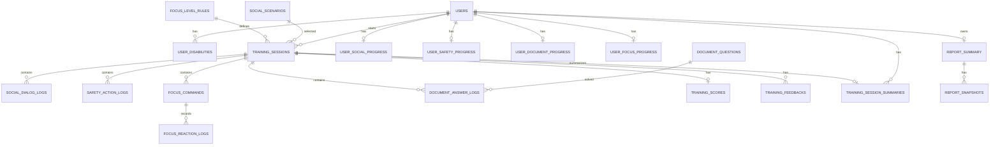

# 데이터베이스 구조 설계

WBS 항목: 3.4 DB/ERD 설계 (https://www.notion.so/3-4-DB-ERD-4faffa9d0afd49bf8053d11ae9062d8b?pvs=21)
상태: 대기
유형: 설계

# 데이터베이스 구조 설계

## 1. 설계 기준

```
user_db     : 사용자 계정, 회원가입, 로그인, 내정보 관리를 담당한다.
training_db : 사회성/안전/집중력/문서이해 훈련의 세션, 로그, 점수, 피드백을 담당한다.
report_db   : 훈련 결과를 집계한 리포트와 리포트 스냅샷을 담당한다.
```

## 1.1 user_id 설계 원칙

```
- 사용자별 데이터는 반드시 user_id를 기준으로 소유자를 식별한다.
- 클라이언트 요청 바디에서 user_id를 직접 받지 않고, 인증 토큰에서 추출한 사용자 ID를 서버가 사용한다.
- 훈련 원본 콘텐츠 테이블에는 user_id를 넣지 않는다.
  예: social_scenarios, safety_scenarios, safety_scenes, safety_choices, document_questions
- 사용자 수행 결과 또는 사용자별 요약 테이블에는 user_id를 직접 저장한다.
  예: training_sessions, user_*_progress, training_session_summaries, report_summary
- 세부 로그 테이블은 session_id를 통해 user_id를 추적한다.
  예: social_dialog_logs, safety_action_logs, focus_reaction_logs, document_answer_logs
```

## 1.2 정합성 보완 기준

```
- 훈련 기록 목록 화면은 원본 로그 테이블을 직접 조회하지 않고 training_session_summaries를 우선 조회한다.
- 훈련 상세 화면은 session_id 기반으로 원본 로그 테이블을 조회한다.
- training_session_summaries는 목록 화면에 필요한 시나리오명, 카테고리, 점수, 정답 수, 피드백 요약을 스냅샷 형태로 보관한다.
- 집중력 훈련은 별도 상세보기 API를 제공하지 않고, progress 조회와 sessions 목록 조회로 결과 확인을 대체한다.
- focus_reaction_logs는 내부 분석, 리포트 계산, 운영 점검 용도로 사용한다.
```

## 1.3 training_session_summaries 필수 설계 기준

훈련 기록 목록 API와 훈련 현황 화면의 조회 성능 및 문서 간 정합성을 위해 `training_session_summaries`는 다음 필드를 포함한다.

### 필수 속성

| 속성명 | 설명 |
| --- | --- |
| summary_id | 훈련 세션 요약 고유 ID |
| user_id | 사용자 ID |
| session_id | 훈련 세션 ID |
| training_type | 훈련 유형: SOCIAL, SAFETY, FOCUS, DOCUMENT |
| sub_type | 세부 유형. 사회성은 jobType, 집중력은 level 값 저장 |
| scenario_id | 시나리오 ID. 시나리오 기반 훈련이 아닌 경우 NULL 허용 |
| scenario_title | 목록 화면 표시용 시나리오 제목 스냅샷 |
| category | 안전 훈련 카테고리 등 목록 필터용 분류값 |
| score | 대표 점수 |
| accuracy_rate | 정확도. 집중력 또는 정답률 기반 훈련에서 사용 |
| correct_count | 정답 수 |
| total_count | 전체 문항/선택/지시 수 |
| wrong_count | 오답 수 |
| average_reaction_ms | 평균 반응 시간. 집중력 훈련에서 사용 |
| feedback_summary | 목록 화면 표시용 간략 피드백 |
| completed_at | 훈련 완료 일시 |
| created_at | 요약 생성 일시 |

### 제약 조건

```
PK: summary_id
FK: user_id → users.user_id
FK: session_id → training_sessions.session_id
UNIQUE: session_id
NOT NULL: user_id, session_id, training_type, completed_at, created_at
CHECK: training_type IN ('SOCIAL', 'SAFETY', 'FOCUS', 'DOCUMENT')
CHECK: score BETWEEN 0 AND 100 또는 NULL 허용
CHECK: accuracy_rate BETWEEN 0 AND 100 또는 NULL 허용
CHECK: correct_count >= 0 또는 NULL 허용
CHECK: total_count >= 0 또는 NULL 허용
CHECK: wrong_count >= 0 또는 NULL 허용
CHECK: average_reaction_ms >= 0 또는 NULL 허용
```

### 조회 기준

```
- 훈련 기록 목록 API는 training_session_summaries를 우선 조회한다.
- 상세 조회 API는 training_session_summaries가 아니라 각 훈련별 원본 로그 테이블을 조회한다.
- 훈련 완료 시 Training Service가 원본 로그, 점수, 피드백 저장 후 training_session_summaries를 생성한다.
```

## 2. 핵심 ERD



---

# 3. user_db

## 3.1 users

사용자 계정과 기본 정보를 관리하기 위한 테이블.

### 속성

| 속성명 | 설명 |
| --- | --- |
| user_id | 사용자 고유 ID |
| login_id | 로그인에 사용하는 아이디 |
| password_hash | 비밀번호 해시값 |
| name | 사용자 이름 |
| birth_date | 생년월일 |
| gender | 성별 |
| email | 이메일 |
| desired_job | 희망직무 |
| status | 사용자 계정 상태 |
| created_at | 생성일시 |
| updated_at | 수정일시 |
| last_login_at | 마지막 로그인 일시 |

### 제약 조건

```
PK: user_id
UNIQUE: login_id, email
NOT NULL: login_id, password_hash, name, birth_date, email, status, created_at
CHECK: status IN ('ACTIVE', 'LOCKED', 'WITHDRAWN')
CHECK: gender IN ('MALE', 'FEMALE', 'NONE') 또는 NULL 허용
```

## 3.2 user_disabilities

사용자의 장애유형 중복 선택 정보를 저장하기 위한 테이블.

### 속성

| 속성명 | 설명 |
| --- | --- |
| disability_id | 장애유형 선택 고유 ID |
| user_id | 사용자 ID |
| disability_type | 장애유형 |
| created_at | 생성일시 |

### 제약 조건

```
PK: disability_id
FK: user_id → users.user_id
NOT NULL: user_id, disability_type, created_at
UNIQUE: user_id + disability_type
```

---

# 4. training_db

## 4.1 training_sessions

훈련 시작부터 종료까지의 공통 세션을 관리하기 위한 테이블.

### 속성

| 속성명 | 설명 |
| --- | --- |
| session_id | 훈련 세션 고유 ID |
| user_id | 사용자 ID |
| training_type | 훈련 유형 |
| sub_type | 세부 유형 |
| scenario_id | 선택한 시나리오 ID |
| status | 훈련 진행 상태 |
| current_step | 현재 진행 단계 |
| started_at | 시작일시 |
| ended_at | 종료일시 |

### 제약 조건

```
PK: session_id
FK: user_id → users.user_id
NOT NULL: user_id, training_type, status, started_at
CHECK: training_type IN ('SOCIAL', 'SAFETY', 'FOCUS', 'DOCUMENT')
CHECK: status IN ('IN_PROGRESS', 'COMPLETED', 'FAILED')
CHECK: training_type != 'FOCUS' OR sub_type IS NOT NULL
- 집중력 훈련의 sub_type에는 선택한 level 값을 저장한다.
```

## 4.2 social_scenarios

사회성 훈련의 상황(시나리오) 콘텐츠를 관리하기 위한 테이블.

### 속성

| 속성명 | 설명 |
| --- | --- |
| scenario_id | 시나리오 고유 ID |
| job_type | 직무 유형 |
| title | 시나리오 제목 |
| background_text | 배경 설명 |
| situation_text | 상황 설명 |
| character_info | 등장 인물 정보 |
| difficulty | 난이도 |
| is_active | 사용 여부 |

### 제약 조건

```
PK: scenario_id
NOT NULL: job_type, title, situation_text
CHECK: job_type IN ('OFFICE','LABOR')
DEFAULT: is_active = true
```

## 4.3 social_dialog_logs

사회성 훈련의 사용자-AI 대화 로그를 저장하기 위한 테이블.

### 속성

| 속성명 | 설명 |
| --- | --- |
| log_id | 대화 로그 고유 ID |
| session_id | 훈련 세션 ID |
| turn_no | 대화 순서 |
| speaker | 발화 주체 |
| content | 대화 내용 |
| created_at | 생성일시 |

### 제약 조건

```
PK: log_id
FK: session_id → training_sessions.session_id
NOT NULL: session_id, turn_no, speaker, content, created_at
CHECK: speaker IN ('USER', 'AI')
UNIQUE: session_id + turn_no + speaker
```

## 4.3.1 user_social_progress

사용자별 사회성 훈련 최신 진행 요약을 관리하기 위한 테이블.

### 속성

| 속성명 | 설명 |
| --- | --- |
| progress_id | 사회성 진행 상태 고유 ID |
| user_id | 사용자 ID |
| recent_session_id | 최근 완료한 사회성 훈련 세션 ID |
| recent_score | 최근 사회성 훈련 대표 점수 |
| recent_feedback_summary | 최근 사회성 훈련 간략 피드백 |
| completed_count | 완료한 사회성 훈련 횟수 |
| last_completed_at | 마지막 완료일시 |
| updated_at | 수정일시 |

### 제약 조건

```
PK: progress_id
FK: user_id → users.user_id
FK: recent_session_id → training_sessions.session_id
UNIQUE: user_id
NOT NULL: user_id, completed_count, updated_at
CHECK: recent_score BETWEEN 0 AND 100
CHECK: completed_count >= 0
```

## 4.4 safety_scenarios

안전 훈련 시나리오를 관리하기 위한 테이블.

### 속성

| 속성명 | 설명 |
| --- | --- |
| scenario_id | 시나리오 고유 ID |
| title | 시나리오 제목 |
| category | 안전 훈련 상황 분류 |
| description | 시나리오 설명 |
| is_active | 사용 여부 |
| created_at | 생성일시 |

### 제약 조건

```
PK: scenario_id
NOT NULL: title, category, is_active, created_at
CHECK: category IN ('SEXUAL_EDUCATION', 'INFECTIOUS_DISEASE', 'COMMUTE_SAFETY')
DEFAULT: is_active = true
```

## 4.5 safety_scenes

안전 훈련의 장면, 상황, 질문을 저장하기 위한 테이블.

### 속성

| 속성명 | 설명 |
| --- | --- |
| scene_id | 장면 고유 ID |
| scenario_id | 시나리오 ID |
| scene_order | 장면 순서 |
| screen_info | 화면 정보 |
| situation_text | 상황 설명 |
| question_text | 질문 내용 |
| is_end_scene | 종료 장면 여부 |

### 제약 조건

```
PK: scene_id
FK: scenario_id → safety_scenarios.scenario_id
NOT NULL: scenario_id, scene_order, situation_text, question_text, is_end_scene
UNIQUE: scenario_id + scene_order
DEFAULT: is_end_scene = false
```

## 4.6 safety_choices

안전 훈련 장면별 선택지를 저장하기 위한 테이블.

### 속성

| 속성명 | 설명 |
| --- | --- |
| choice_id | 선택지 고유 ID |
| scene_id | 장면 ID |
| choice_text | 선택지 내용 |
| next_scene_id | 다음 장면 ID |
| is_correct | 올바른 선택 여부 |

### 제약 조건

```
PK: choice_id
FK: scene_id → safety_scenes.scene_id
FK: next_scene_id → safety_scenes.scene_id
NOT NULL: scene_id, choice_text, is_correct
```

## 4.7 safety_action_logs

안전 훈련에서 사용자의 선택 이력을 저장하기 위한 테이블.

### 속성

| 속성명 | 설명 |
| --- | --- |
| action_id | 선택 이력 고유 ID |
| session_id | 훈련 세션 ID |
| scene_id | 장면 ID |
| choice_id | 선택지 ID |
| is_correct | 정답 여부 |
| created_at | 생성일시 |

### 제약 조건

```
PK: action_id
FK: session_id → training_sessions.session_id
FK: scene_id → safety_scenes.scene_id
FK: choice_id → safety_choices.choice_id
NOT NULL: session_id, scene_id, choice_id, is_correct, created_at
```

## 4.7.1 user_safety_progress

사용자별 안전 훈련 최신 진행 요약을 관리하기 위한 테이블.

### 속성

| 속성명 | 설명 |
| --- | --- |
| progress_id | 안전 진행 상태 고유 ID |
| user_id | 사용자 ID |
| recent_session_id | 최근 완료한 안전 훈련 세션 ID |
| correct_count | 안전 훈련 정답 선택 수 |
| total_count | 안전 훈련 전체 선택 수 |
| completed_count | 완료한 안전 훈련 수 |
| last_completed_at | 마지막 완료일시 |
| updated_at | 수정일시 |

### 제약 조건

```
PK: progress_id
FK: user_id → users.user_id
FK: recent_session_id → training_sessions.session_id
UNIQUE: user_id
NOT NULL: user_id, correct_count, total_count, completed_count, updated_at
CHECK: correct_count >= 0
CHECK: total_count >= 0
CHECK: correct_count <= total_count
CHECK: completed_count >= 0
```

## 4.8 focus_level_rules

집중력 훈련의 단계별 규칙을 관리하기 위한 테이블.

### 속성

| 속성명 | 설명 |
| --- | --- |
| level | 집중력 훈련 단계 |
| duration_seconds | 훈련 제한 시간. 기본 180초 |
| command_interval_ms | 지시 표시 간격(ms) |
| command_complexity | 지시 복잡도 |
| required_accuracy_rate | 다음 단계 해금 기준 정확도 |
| is_active | 사용 여부 |
| created_at | 생성일시 |
| updated_at | 수정일시 |

### 제약 조건

```
PK: level
NOT NULL: level, duration_seconds, command_interval_ms, command_complexity, required_accuracy_rate, is_active, created_at, updated_at
CHECK: level >= 1
CHECK: duration_seconds > 0
CHECK: command_interval_ms > 0
CHECK: required_accuracy_rate BETWEEN 0 AND 100
DEFAULT: duration_seconds = 180
DEFAULT: required_accuracy_rate = 90
DEFAULT: is_active = true
```

## 4.9 focus_commands

집중력 훈련에서 생성된 청기백기 지시 목록을 저장하기 위한 테이블.

### 속성

| 속성명 | 설명 |
| --- | --- |
| command_id | 지시 고유 ID |
| session_id | 훈련 세션 ID |
| command_order | 지시 순서 |
| command_text | 지시 내용 |
| expected_action | 정답 동작 |
| display_at_ms | 표시 시점(ms) |

### 제약 조건

```
PK: command_id
FK: session_id → training_sessions.session_id
NOT NULL: session_id, command_order, command_text, expected_action, display_at_ms
UNIQUE: session_id + command_order
```

## 4.9 focus_reaction_logs

집중력 훈련에서 사용자의 반응 결과를 저장하기 위한 테이블.

### 속성

| 속성명 | 설명 |
| --- | --- |
| reaction_id | 반응 로그 고유 ID |
| command_id | 지시 ID |
| session_id | 훈련 세션 ID |
| user_input | 사용자 입력값 |
| is_correct | 정답 여부 |
| reaction_ms | 반응 시간(ms) |
| created_at | 생성일시 |

### 제약 조건

```
PK: reaction_id
FK: command_id → focus_commands.command_id
FK: session_id → training_sessions.session_id
NOT NULL: command_id, session_id, user_input, is_correct, reaction_ms, created_at
UNIQUE: command_id + session_id
CHECK: reaction_ms >= 0
```

## 4.10 user_focus_progress

사용자별 집중력 훈련 단계 진행 상태를 관리하기 위한 테이블.

### 속성

| 속성명 | 설명 |
| --- | --- |
| progress_id | 집중력 진행 상태 고유 ID |
| user_id | 사용자 ID |
| current_level | 현재 사용자가 도달한 집중력 훈련 단계 |
| highest_unlocked_level | 사용자가 선택 가능한 최고 해금 단계 |
| last_played_level | 마지막으로 수행한 단계 |
| last_accuracy_rate | 마지막 수행 정확도 |
| last_average_reaction_ms | 마지막 평균 반응 시간(ms) |
| updated_at | 수정일시 |

### 제약 조건

```
PK: progress_id
FK: user_id → users.user_id
UNIQUE: user_id
NOT NULL: user_id, current_level, highest_unlocked_level, updated_at
CHECK: current_level >= 1
CHECK: highest_unlocked_level >= 1
CHECK: last_accuracy_rate BETWEEN 0 AND 100
CHECK: last_average_reaction_ms >= 0
```

## 4.11 document_questions

문서 이해 훈련의 문제와 정답 콘텐츠를 관리하기 위한 테이블.

### 속성

| 속성명 | 설명 |
| --- | --- |
| question_id | 문제 고유 ID |
| title | 문제 제목 |
| document_text | 문서 본문 |
| question_text | 질문 내용 |
| question_type | 문제 유형 |
| correct_answer | 정답 |
| explanation | 해설 |
| difficulty | 난이도 |
| is_active | 사용 여부 |

### 제약 조건

```
PK: question_id
NOT NULL: title, question_text, correct_answer
DEFAULT: is_active = true
```

## 4.12 document_answer_logs

문서 이해 훈련의 문제별 답변 결과를 저장하기 위한 테이블.

### 속성

| 속성명 | 설명 |
| --- | --- |
| answer_id | 답변 로그 고유 ID |
| session_id | 훈련 세션 ID |
| question_id | 문제 ID |
| user_answer | 사용자 답변 |
| correct_answer | 정답 |
| is_correct | 정답 여부 |
| explanation | 해설 |
| created_at | 생성일시 |

### 제약 조건

```
PK: answer_id
FK: session_id → training_sessions.session_id
FK: question_id → document_questions.question_id
NOT NULL: session_id, question_id, user_answer, correct_answer, is_correct, created_at
UNIQUE: session_id + question_id
```

## 4.12.1 user_document_progress

사용자별 문서 이해 훈련 최신 진행 요약을 관리하기 위한 테이블.

### 속성

| 속성명 | 설명 |
| --- | --- |
| progress_id | 문서 이해 진행 상태 고유 ID |
| user_id | 사용자 ID |
| recent_session_id | 최근 완료한 문서 이해 훈련 세션 ID |
| correct_count | 최근 문서 이해 훈련 정답 수 |
| total_count | 최근 문서 이해 훈련 전체 문제 수 |
| recent_score | 최근 문서 이해 훈련 대표 점수 |
| completed_count | 완료한 문서 이해 훈련 횟수 |
| last_completed_at | 마지막 완료일시 |
| updated_at | 수정일시 |

### 제약 조건

```
PK: progress_id
FK: user_id → users.user_id
FK: recent_session_id → training_sessions.session_id
UNIQUE: user_id
NOT NULL: user_id, correct_count, total_count, completed_count, updated_at
CHECK: correct_count >= 0
CHECK: total_count >= 0
CHECK: correct_count <= total_count
CHECK: recent_score BETWEEN 0 AND 100
CHECK: completed_count >= 0
```

## 4.13 training_scores

훈련 세션의 대표 점수와 유형별 산출 지표를 저장하기 위한 테이블.

### 속성

| 속성명 | 설명 |
| --- | --- |
| score_id | 훈련 점수 고유 ID |
| session_id | 훈련 세션 ID |
| score | 대표 점수 |
| score_type | 점수 산출 방식 |
| correct_count | 정답 수 |
| total_count | 전체 문항/선택/지시 수 |
| accuracy_rate | 정확도 |
| wrong_count | 오답 수 |
| average_reaction_ms | 평균 반응 시간(ms). 집중력 훈련에서 사용 |
| raw_metrics_json | 훈련 유형별 추가 산출 지표 JSON |
| created_at | 생성일시 |

### 제약 조건

```
PK: score_id
FK: session_id → training_sessions.session_id
UNIQUE: session_id
NOT NULL: session_id, score, score_type, created_at
CHECK: score BETWEEN 0 AND 100
CHECK: score_type IN ('AI_EVALUATION', 'ACCURACY_RATE', 'REACTION_PERFORMANCE', 'CHOICE_RESULT')
CHECK: correct_count >= 0
CHECK: total_count >= 0
CHECK: correct_count <= total_count
CHECK: accuracy_rate BETWEEN 0 AND 100
CHECK: wrong_count >= 0
CHECK: average_reaction_ms >= 0
```

## 4.14 training_feedbacks

훈련 세션별 피드백을 저장하기 위한 테이블.

### 속성

| 속성명 | 설명 |
| --- | --- |
| feedback_id | 피드백 고유 ID |
| session_id | 훈련 세션 ID |
| feedback_type | 피드백 유형 |
| summary | 목록/요약 화면에 표시할 간략 피드백 |
| detail_text | 상세 피드백 본문 |
| created_at | 생성일시 |

### 제약 조건

```
PK: feedback_id
FK: session_id → training_sessions.session_id
NOT NULL: session_id, feedback_type, summary, created_at
CHECK: feedback_type IN ('AI', 'RULE_BASED', 'SYSTEM')
```

## 4.15 training_session_summaries

훈련 기록 목록 화면에 표시할 사용자별 세션 요약 정보를 저장하기 위한 테이블.

### 속성

| 속성명 | 설명 |
| --- | --- |
| summary_id | 훈련 기록 요약 고유 ID |
| session_id | 훈련 세션 ID |
| user_id | 사용자 ID |
| training_type | 훈련 유형 |
| scenario_id | 훈련에 사용된 시나리오 ID |
| scenario_title | 목록에 표시할 시나리오 제목 |
| category | 안전 훈련 카테고리. 안전 훈련이 아닌 경우 NULL |
| title | 목록에 표시할 훈련 제목 |
| score | 대표 점수 |
| summary_text | 목록에 표시할 요약 문구 |
| feedback_summary | 목록에 표시할 간략 피드백 |
| correct_count | 정답 수 |
| total_count | 전체 문항/선택/지시 수 |
| accuracy_rate | 정확도 |
| wrong_count | 오답 수 |
| played_level | 집중력 훈련 수행 단계 |
| average_reaction_ms | 평균 반응 시간(ms) |
| completed_at | 훈련 완료일시 |
| created_at | 생성일시 |

### 제약 조건

```
PK: summary_id
FK: session_id → training_sessions.session_id
FK: user_id → users.user_id
UNIQUE: session_id
NOT NULL: session_id, user_id, training_type, title, completed_at, created_at
CHECK: training_type IN ('SOCIAL', 'SAFETY', 'FOCUS', 'DOCUMENT')
CHECK: category IN ('SEXUAL_EDUCATION', 'INFECTIOUS_DISEASE', 'COMMUTE_SAFETY') 또는 NULL 허용
CHECK: score BETWEEN 0 AND 100
CHECK: correct_count >= 0
CHECK: total_count >= 0
CHECK: correct_count <= total_count
CHECK: accuracy_rate BETWEEN 0 AND 100
CHECK: wrong_count >= 0
CHECK: played_level >= 1
CHECK: average_reaction_ms >= 0
```

### 저장 기준

```
- 훈련 완료 시 Training Service가 training_scores, training_feedbacks, 각 훈련 로그 저장 후 함께 생성한다.
- 훈련 기록 목록 조회 API는 user_id와 training_type을 조건으로 이 테이블만 조회한다.
- 안전 훈련 기록은 category를 함께 저장해 성 관련 교육, 감염병 교육, 출퇴근 안전 교육을 구분한다.
- 상세보기 API는 기존 로그/점수/피드백 원본 테이블을 조회한다.
- session_id만으로도 사용자 추적은 가능하지만, 목록 조회 성능과 사용자별 필터링을 위해 user_id를 중복 저장한다.
```

## 4.14 training_scores

훈련 세션별 리포트 표시용 대표 점수와 공통 결과를 저장하기 위한 테이블.

### 속성

| 속성명 | 설명 |
| --- | --- |
| score_id | 점수 고유 ID |
| session_id | 훈련 세션 ID |
| score | 리포트에 표시할 대표 점수 |
| score_type | 점수 산정 방식 |
| accuracy_rate | 정답률 기반 훈련의 정확도 |
| wrong_count | 오답 수 |
| level_result | 집중력 훈련 단계 결과 |
| raw_metrics_json | 훈련별 세부 지표 JSON |
| created_at | 생성일시 |

### 제약 조건

```
PK: score_id
FK: session_id → training_sessions.session_id
UNIQUE: session_id
NOT NULL: session_id, score, score_type, created_at
CHECK: score BETWEEN 0 AND 100
CHECK: score_type IN ('AI_EVALUATION', 'ACCURACY_RATE', 'REACTION_PERFORMANCE', 'CHOICE_RESULT')
CHECK: accuracy_rate BETWEEN 0 AND 100
CHECK: wrong_count >= 0

훈련별 사용 예시:
- 사회성 훈련: score_type = 'AI_EVALUATION', raw_metrics_json에 대화 품질/응답 적절성/사회적 표현 점수 저장
- 안전 훈련: score_type = 'CHOICE_RESULT', raw_metrics_json에 전체 선택 수/정답 선택 수/위험 선택 수 저장
- 집중력 훈련: score_type = 'REACTION_PERFORMANCE', raw_metrics_json에 평균 반응시간/지시 수 등 세션 상세 지표 저장
- 집중력 훈련의 현재 단계와 해금 단계는 user_focus_progress에 별도 저장
- 문서 이해 훈련: score_type = 'ACCURACY_RATE', raw_metrics_json에 전체 문제 수/정답 수/오답 수 저장
```

## 4.15 training_feedbacks

훈련별 피드백과 해석 내용을 저장하기 위한 테이블.

### 속성

| 속성명 | 설명 |
| --- | --- |
| feedback_id | 피드백 고유 ID |
| session_id | 훈련 세션 ID |
| feedback_type | 피드백 유형 |
| feedback_source | 피드백 생성 주체 |
| summary | 피드백 요약 |
| detail_text | 상세 피드백 |
| created_at | 생성일시 |

### 제약 조건

```
PK: feedback_id
FK: session_id → training_sessions.session_id
NOT NULL: session_id, feedback_type, feedback_source, summary, created_at
CHECK: feedback_type IN ('SUMMARY', 'DETAIL', 'RECOMMENDATION')
CHECK: feedback_source IN ('AI', 'SYSTEM')
```

---

# 5. report_db

## 5.1 report_summary

사용자별 최신 리포트 요약을 저장하기 위한 테이블.

### 속성

| 속성명 | 설명 |
| --- | --- |
| report_id | 리포트 고유 ID |
| user_id | 사용자 ID |
| social_score | 사회성 훈련 점수 |
| safety_score | 안전 훈련 점수 |
| focus_score | 집중력 훈련 점수 |
| document_score | 문서 이해 훈련 점수 |
| progress_rate | 전체 진행률 |
| readiness_score | 직무 준비도 점수 |
| strengths_text | 강점 내용 |
| weaknesses_text | 보완점 내용 |
| comment_text | 종합 코멘트 |
| updated_at | 수정일시 |

### 제약 조건

```
PK: report_id
UNIQUE: user_id
NOT NULL: user_id, updated_at
CHECK: social_score BETWEEN 0 AND 100
CHECK: safety_score BETWEEN 0 AND 100
CHECK: focus_score BETWEEN 0 AND 100
CHECK: document_score BETWEEN 0 AND 100
CHECK: progress_rate BETWEEN 0 AND 100
CHECK: readiness_score BETWEEN 0 AND 100
```

## 5.2 report_snapshots

특정 시점의 리포트를 보관하기 위한 테이블.

### 속성

| 속성명 | 설명 |
| --- | --- |
| snapshot_id | 스냅샷 고유 ID |
| report_id | 리포트 ID |
| snapshot_json | 리포트 스냅샷 JSON |
| created_at | 생성일시 |

### 제약 조건

```
PK: snapshot_id
FK: report_id → report_summary.report_id
NOT NULL: report_id, snapshot_json, created_at
```

---

# 6. 인덱스 전략

```
users(login_id)
users(email)
user_disabilities(user_id)
training_sessions(user_id, training_type, started_at)
social_dialog_logs(session_id, turn_no)
safety_action_logs(session_id)
focus_commands(session_id, command_order)
focus_reaction_logs(session_id)
user_social_progress(user_id)
user_safety_progress(user_id)
user_focus_progress(user_id)
user_document_progress(user_id)
document_answer_logs(session_id)
training_scores(session_id)
safety_scenarios(category, is_active)
training_session_summaries(user_id, training_type, completed_at)
training_session_summaries(user_id, training_type, category, completed_at)
report_summary(user_id)
```

# 7. 운영 고려사항

```
- Refresh Token은 RDB 테이블에 저장하지 않고 Redis에 저장한다.
- Redis Key 형식은 refresh_token:{userId}로 관리한다.
- 로그인 성공 시 Refresh Token을 Redis에 저장하고, 로그아웃 시 해당 Key를 삭제한다.
- Refresh Token 만료 시간은 Redis TTL로 관리한다.
- Access Token 블랙리스트가 필요한 경우 token_blacklist:{tokenId} 또는 token_blacklist:{accessTokenHash} 형태로 Redis에 저장한다.
- 모든 사용자별 조회는 인증 토큰에서 추출한 user_id를 기준으로 수행한다.
- session_id 기반 상세 조회 시 해당 session_id가 현재 user_id의 세션인지 반드시 검증한다.
- 개인정보(email 등)는 암호화 또는 마스킹 정책을 적용한다.
- password_hash에는 원문 비밀번호를 저장하지 않는다.
- 대화 로그와 반응 로그는 데이터 증가량이 크므로 파티셔닝을 고려한다.
- 훈련 종료 시 세션, 로그, 점수, 피드백 저장은 트랜잭션으로 처리한다.
- 리포트는 TrainingCompleted 이벤트 기반으로 비동기 갱신한다.
```
